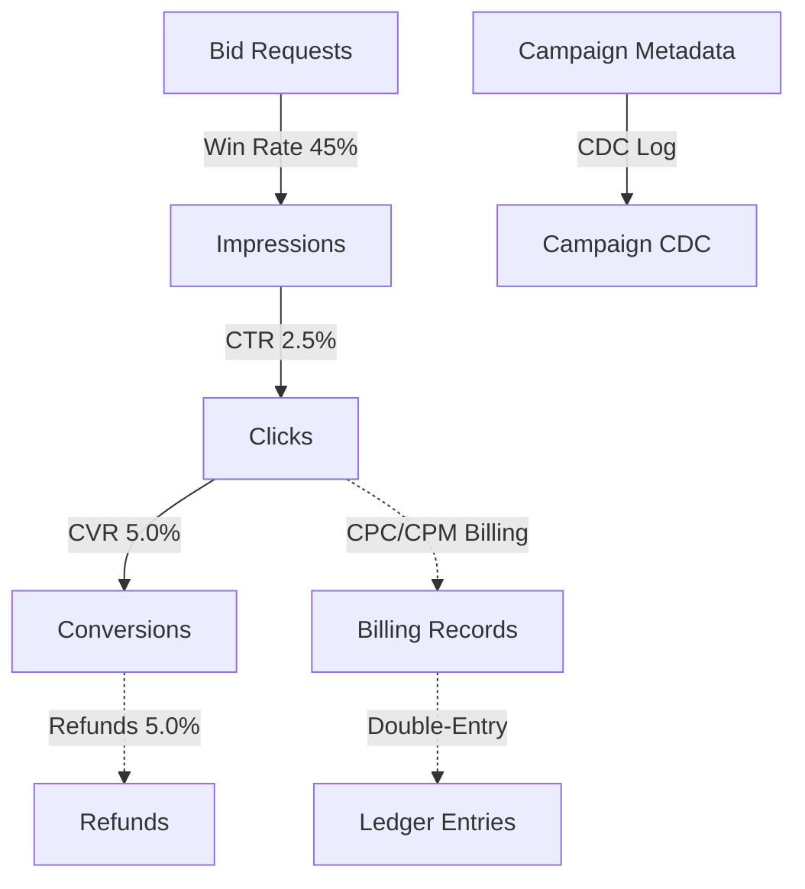

# 🚀 FAANG-Scale Real-Time AdTech & Financial Data Simulator

An enterprise-grade, high-throughput event simulator built for **Databricks and Spark Streaming** designed to stress-test modern lakehouses (Delta Lake) and distributed processing engines (Apache Spark/Flink). 

This project simulates a complete, real-world digital advertising funnel combined with complex financial ledgers. Instead of generating sterile "happy path" mock data, it intentionally injects **14 real-world production challenges**—including click-farm fraud, schema evolution, clock skews, and rounding artifacts—making it a perfect framework for engineering robust, self-healing data pipelines.

**Clone / shared folder:** see `WORKSPACE.md`. On this machine the repo is `/agent/adtech-finacne-databricks`. Python lives in `generator_src/`; generated JSON goes to `data/landing/`.

```bash
pip install -r requirements.txt
python3 run_local.py --iterations 1          # same job as Databricks notebook 03
python3 run_source_adapter.py                # Databricks notebook 04: topics → vendor landings
```

---

## 💡 Why This Was Built (The Engineering Problem)
In production, streaming pipelines rarely fail because of the "happy path." They fail due to:
* **Late-Arriving Data:** Conversions matching clicks that occurred 48 hours ago.
* **Distributed Race Conditions:** Impressions arriving *before* the corresponding bid requests.
* **Schema Drift:** A producer upgrading their schema version without notifying downstream consumers.
* **Financial Rounding Drift:** Floating-point inconsistencies accumulating millions of dollars in billing errors.

This simulator was engineered to provide **unpredictable, mathematically realistic, and highly skewed datasets** to test downstream recovery, deduplication, auditing, and reconciliation engines under extreme conditions.

---

## 🏗️ Funnel Architecture & Event Lineage
The generator models a realistic multi-stage user journey. Each event type is mathematically tied to its parent event using deterministic probability curves (ctr, cvr, win-rates):



### Generated Event Streams:
1. **`bid_requests`**: High-volume, real-time user auctions containing location, device, auction floor prices, and browser user-agents.
2. **`impressions`**: Served ads with clearing prices and simulated viewability scores.
3. **`clicks`**: User interactions with precise timing intervals and cost tracking.
4. **`conversions`**: Purchase records mapping downstream attribution to initial clicks.
5. **`refunds`**: Delayed financial reversal events targeting previous conversions.
6. **`billing_records`**: Automated financial records calculating advertisers' exact spend (CPC/CPM).
7. **`ledger_entries`**: Double-entry bookkeeping streams containing matching debits/credits for auditability.
8. **`campaign_cdc`**: Change-Data-Capture logs tracking campaign budget changes and targeting state transitions.

---

## 🌀 Built-in "Production Chaos" (Interview Talking Points)

The core differentiator of this simulator is its **pluggable chaos engine**, injecting complex distributed system failures:

### 1. 🧬 Rolling Schema Evolution (V1 to V8)
Simulates rolling application deployments. Generators dynamically upgrade event structures on-the-fly (e.g., transitioning from float to double, adding nested objects, type widening/narrowing, or deprecating fields). Downstream pipelines must handle multi-version parsing concurrently.

### 2. 🤖 Sophisticated Fraud & Click-Farms
Injects realistic bad-actor patterns to test real-time fraud detection:
* **Bot Signatures:** High-frequency click streams with near-zero timing jitter from localized IP blocks.
* **Impression Stuffing:** Zero-area iframes triggering inflated CPM costs.
* **Conversion Fraud:** Conversions generated without a corresponding upstream click-chain.

### 3. 🕒 Time Travel & Clock Divergence
* **Clock Skew:** Skews producer timestamps by up to $\pm$ 4 hours to test out-of-order streaming watermarks.
* **Timezone Confusion:** Intermittently writes timestamps in localized UTC skews instead of standard ISO-8601 UTC.
* **NTP Rollbacks:** Forces system timestamps to jump backward, simulating network time sync resets.

### 4. 📈 Dynamic Traffic Dynamics
* **Poisson Variance:** Mimics real-world organic traffic fluctuations.
* **Peak Hour Wave:** Automatically multiplies traffic during simulated "working hours" and dampens traffic on weekends.
* **Burst Traffic & Hot Partitions:** Simulates a viral ad campaign, skewing 90% of traffic to a single partition key, stress-testing Spark's distributed join skew mitigation.

### 💸 5. Strict Financial Consistency Challenges
* ** rounding Artifacts:** Artificially injects tiny floating-point errors ($10^{-10}$) that accumulate into huge audit discrepancies downstream.
* **Negative Adjustments:** Simulates chargebacks and fraud reversals, generating negative dollar values that test strict accounting compliance.
* **Overbilling Scenarios:** Intentionally generates minor pricing errors to test programmatic reconciliations.

---

## ⚙️ Decoupled, YAML-driven Configuration
The simulator is highly customizable using a single, unified configuration file (`generator_config.yaml`). Every probability curve, seed, skew, and fraud rate can be tuned dynamically:

```yaml
platform:
  seed: 42
  batch_interval_seconds: 5
  enable_validation: true

event_rates:
  bid_requests:
    fraud_percentage: 0.08
    late_event_pct: 0.05
    duplicate_pct: 0.02
  conversions:
    cvr_base: 0.05
    delayed_conversion_max_hours: 48
    duplicate_pct: 0.01

edge_cases:
  financial:
    zero_cost_campaign_pct: 0.02
    currency_rounding_pct: 0.01
```

---

## 🚀 Execution & Quick Start (Databricks)

The pipeline is split logically into **modular notebooks** to align with Databricks best practices (writing Python modules to `/Workspace` and using native cloud-backed volumes):

### Step 1: Install Dependencies
Open and run **`00_install_deps.ipynb`** to set up standard validated packages (`numpy`, `pyyaml`, `jsonschema`).

### Step 2: Compile Python Modules
Run **`01_write_modules.ipynb`**. This notebook compiles and writes the core simulator engine directly to your Workspace directory:
`/Workspace/Users/<email>/adtech/generator_src/`

### Step 3: Overwrite YAML Config
Run **`02_write_config.ipynb`** to generate the robust `generator_config.yaml` file on disk.

### Step 4: Stream the Orchestrator
Open **`03_run_generator.ipynb`** and click "Run All". 
This spins up the `GeneratorOrchestrator`, which orchestrates all 8 parallel streams continuously, applying the chaos filters and writing clean, standardized json data directly into your cloud-backed **Unity Catalog Volumes** for ultimate high-throughput performance!

---

## 🏅 Professional Portfolios & Interview Tips
If you are presenting this project in a data engineering interview, focus your talking points on:
1. **Decoupled Architecture:** How the generator divides simulation, state, and serialization (separating the config, the database-relative workspace, and cloud storage volumes).
2. **Deterministic Reproducibility:** How every generator uses a deterministic, mathematically isolated NumPy Random Generator seeded using bitwise operations (`global_seed ^ type_hash`), ensuring that complex "chaos" bugs can be fully reproduced and debugged.
3. **Delta Lake Optimization:** How the downstream pipeline handles these hot partitions, late events (using Spark Structured Streaming watermarks), and schema evolution (using Delta Lake's `mergeSchema` and schema enforcement properties).
